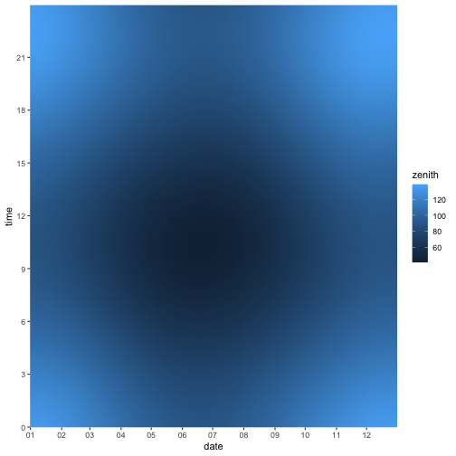
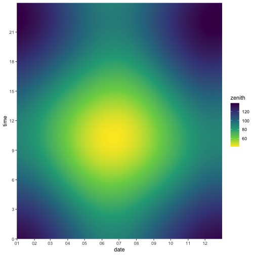
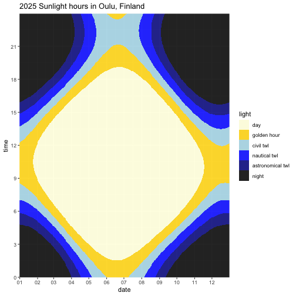
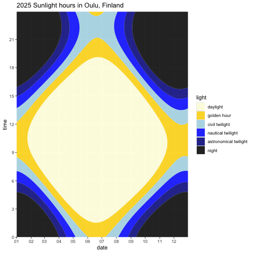

First, run [sunce](https://github.com/klausbrunner/sunce) and capture its output in a CSV file. We're getting position data for the entire year 2025 in Oulu, Finland. 


``` zsh
sunce 65.01 25.47 2025 --timezone="UTC" --deltat --format=csv --headers position --step=3m > /tmp/sunpositions.csv
```

Now read that CSV file, dropping what we don't need and regrouping the data a bit for convenient plotting.


``` r
library(tidyverse)
library(lubridate, warn.conflicts = FALSE)

sunpath <-
  read_csv("/tmp/sunpositions.csv", show_col_types = FALSE) |>
  mutate(
    date = date(dateTime),
    time = hour(dateTime) + minute(dateTime) / 60,
    azimuth = NULL,
    daytime = NULL
  )

sunpath
```

```
## # A tibble: 175,200 × 10
##    latitude longitude elevation pressure temperature dateTime            deltaT
##       <dbl>     <dbl>     <dbl>    <dbl>       <dbl> <dttm>               <dbl>
##  1     65.0      25.5         0     1013          15 2025-01-01 00:00:00   71.7
##  2     65.0      25.5         0     1013          15 2025-01-01 00:03:00   71.7
##  3     65.0      25.5         0     1013          15 2025-01-01 00:06:00   71.7
##  4     65.0      25.5         0     1013          15 2025-01-01 00:09:00   71.7
##  5     65.0      25.5         0     1013          15 2025-01-01 00:12:00   71.7
##  6     65.0      25.5         0     1013          15 2025-01-01 00:15:00   71.7
##  7     65.0      25.5         0     1013          15 2025-01-01 00:18:00   71.7
##  8     65.0      25.5         0     1013          15 2025-01-01 00:21:00   71.7
##  9     65.0      25.5         0     1013          15 2025-01-01 00:24:00   71.7
## 10     65.0      25.5         0     1013          15 2025-01-01 00:27:00   71.7
## # ℹ 175,190 more rows
## # ℹ 3 more variables: zenith <dbl>, date <date>, time <dbl>
```

With the nicely prepared data, plotting should be straightforward now. Getting the axes and labelling right is a bit of a hassle, though.


``` r
library(scales, warn.conflicts = FALSE)

plot <- ggplot(sunpath, aes(date, time)) +
  geom_raster(aes(fill = zenith)) +
  scale_y_continuous(expand = c(0, 0), breaks = seq(0, 24, 3)) +
  scale_x_date(
    labels = date_format("%m"),
    breaks = breaks_width("month"),
    expand = c(0, 0)
  )

plot
```



It's a start, but the default colour palette clearly isn't a good choice.


``` r
plot <- plot + scale_fill_continuous(type = "viridis", direction = -1)

plot
```



Aesthetically better, but still hard to make sense of. It really seems we need a custom colour scheme with irregular breaks, and I haven't had much luck defining those in R. To make this easier and explicit rather than relying on ggplot's colour mapping magic, let's change the data from continuous to categorical first, and use a manual colour mapping.


``` r
sunpath <- sunpath |>
  mutate(light = cut(
    zenith,
    labels = c(
      "day",
      "golden hour",
      "civil twl",
      "nautical twl",
      "astronomical twl",
      "night"
    ),
    breaks = c(0, 84, 90, 96, 102, 108, 180)
  ))

sunpath
```

```
## # A tibble: 175,200 × 11
##    latitude longitude elevation pressure temperature dateTime            deltaT
##       <dbl>     <dbl>     <dbl>    <dbl>       <dbl> <dttm>               <dbl>
##  1     65.0      25.5         0     1013          15 2025-01-01 00:00:00   71.7
##  2     65.0      25.5         0     1013          15 2025-01-01 00:03:00   71.7
##  3     65.0      25.5         0     1013          15 2025-01-01 00:06:00   71.7
##  4     65.0      25.5         0     1013          15 2025-01-01 00:09:00   71.7
##  5     65.0      25.5         0     1013          15 2025-01-01 00:12:00   71.7
##  6     65.0      25.5         0     1013          15 2025-01-01 00:15:00   71.7
##  7     65.0      25.5         0     1013          15 2025-01-01 00:18:00   71.7
##  8     65.0      25.5         0     1013          15 2025-01-01 00:21:00   71.7
##  9     65.0      25.5         0     1013          15 2025-01-01 00:24:00   71.7
## 10     65.0      25.5         0     1013          15 2025-01-01 00:27:00   71.7
## # ℹ 175,190 more rows
## # ℹ 4 more variables: zenith <dbl>, date <date>, time <dbl>, light <fct>
```

``` r
plot <- ggplot(sunpath, aes(date, time)) +
  geom_raster(aes(fill = light), alpha = 0.85) +
  scale_y_continuous(expand = c(0, 0), breaks = seq(0, 24, 3)) +
  labs(title = "2025 Sunlight hours in Oulu, Finland") +
  scale_x_date(
    labels = date_format("%m"),
    breaks = breaks_width("month"),
    expand = c(0, 0)
  ) +
  scale_fill_manual(
    values = c(
      "day" = "lightyellow",
      "golden hour" = "gold",
      "civil twl" = "lightblue",
      "nautical twl" = "blue",
      "astronomical twl" = "blue4",
      "night" = "black"
    )
  )

plot
```



Doesn't have the same mysterious vibe as the previous ones, but it's a bit more useful now: we can clearly see those very long Northern summer days and depressingly long winter nights, peaking on 21 June and 21 December, respectively. 

One of the problems here is that the contours aren't smooth. Which is likely because we're using a raster plot: basically a point matrix. What if we used an actual contour plot after all?


``` r
plot <- ggplot(sunpath, aes(date, time)) +
  geom_contour_filled(aes(z = zenith),
    breaks = c(0, 84, 90, 96, 102, 108, 180),
    alpha = 0.85
  ) +
  scale_fill_manual(
    name = "light",
    values = c("lightyellow", "gold", "lightblue", "blue", "blue4", "black"),
    labels = c(
      "daylight",
      "golden hour",
      "civil twilight",
      "nautical twilight",
      "astronomical twilight",
      "night"
    )
  ) +
  scale_y_continuous(expand = c(0, 0), breaks = seq(0, 24, 3)) +
  labs(title = "2025 Sunlight hours in Oulu, Finland") +
  scale_x_date(
    labels = date_format("%m"),
    breaks = breaks_width("month"),
    expand = c(0, 0)
  )
plot
```



