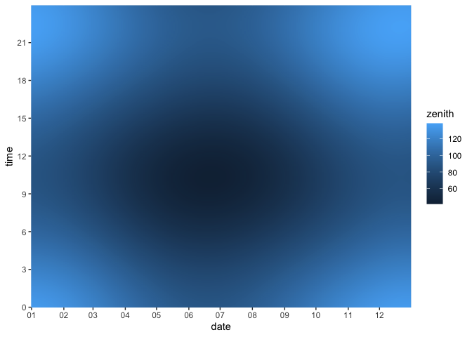
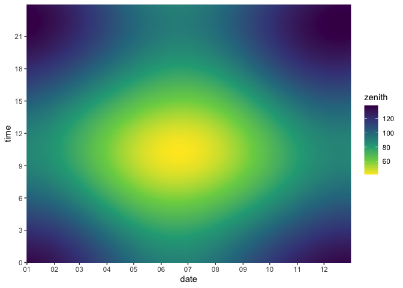
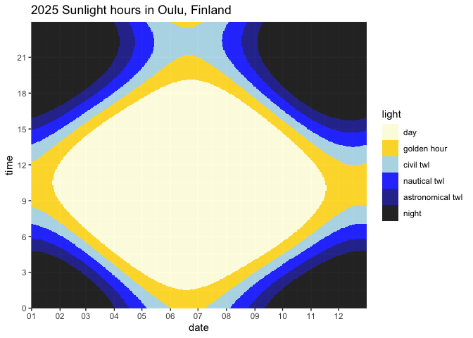

A temporal raster plot (carpet diagram) of sunshine based on
solarpos-cli data
================

First, run [solarpos-cli](https://github.com/KlausBrunner/solarpos-cli)
and capture its output in a CSV file. We’re getting position data for
the entire year 2023 in Rome, Italy. Depending on your setup, you may
have to add the “java” command and an absolute path.

``` sh
solarpos-cli.jar 41.8933 12.4828 2023 --timezone UTC --deltat --format=csv position --step=180 > /tmp/sunpositions.csv
```

Now read that CSV file, dropping what we don’t need and regrouping the
data a bit for convenient plotting.

``` r
library(tidyverse)
library(lubridate, warn.conflicts = FALSE)
```

    ## Loading required package: timechange

``` r
sunpath <- read_csv(
  "/tmp/sunpositions.csv",
  col_names = c("daytime", "azimuth", "zenith"),
  show_col_types = FALSE
) |>
  mutate(
    date = date(daytime),
    time = hour(daytime) + minute(daytime) / 60,
    azimuth = NULL,
    daytime = NULL
  )

sunpath
```

    ## # A tibble: 175,200 × 3
    ##    zenith date        time
    ##     <dbl> <date>     <dbl>
    ##  1   159. 2023-01-01  0   
    ##  2   158. 2023-01-01  0.05
    ##  3   158. 2023-01-01  0.1 
    ##  4   158. 2023-01-01  0.15
    ##  5   158. 2023-01-01  0.2 
    ##  6   157. 2023-01-01  0.25
    ##  7   157. 2023-01-01  0.3 
    ##  8   156. 2023-01-01  0.35
    ##  9   156. 2023-01-01  0.4 
    ## 10   156. 2023-01-01  0.45
    ## # … with 175,190 more rows

With the nicely prepared data, plotting should be straightforward now.
Getting the axes and labelling right is a bit of a hassle, though.

``` r
library(scales, warn.conflicts = FALSE)

plot <- ggplot(sunpath, aes(date, time)) +
  geom_raster(aes(fill = zenith)) +
  scale_y_continuous(expand = c(0, 0), breaks = seq(0, 24, 3)) +
  scale_x_date(
    labels = date_format("%m"),
    breaks = breaks_width("month"),
    expand = c(0, 0)
  )

plot
```

<!-- -->

It’s a start, but the default colour palette clearly isn’t a good
choice.

``` r
plot <- plot + scale_fill_continuous(type = "viridis", direction = -1)

plot
```

<!-- -->

Aesthetically better, but still hard to make sense of. It really seems
we need a custom colour scheme with irregular breaks, and I haven’t had
much luck defining those in R. To make this easier and explicit rather
than relying on ggplot’s colour mapping magic, let’s change the data
from continuous to categorical first, and use a manual colour mapping.

``` r
sunpath <- sunpath |>
  mutate(light = cut(
    zenith,
    labels = c("day", "golden hour", "civil twl", "nautical twl", "astronomical twl", "night"),
    breaks = c(0, 84, 90, 96, 102, 108, 180)
  ))

sunpath
```

    ## # A tibble: 175,200 × 4
    ##    zenith date        time light
    ##     <dbl> <date>     <dbl> <fct>
    ##  1   159. 2023-01-01  0    night
    ##  2   158. 2023-01-01  0.05 night
    ##  3   158. 2023-01-01  0.1  night
    ##  4   158. 2023-01-01  0.15 night
    ##  5   158. 2023-01-01  0.2  night
    ##  6   157. 2023-01-01  0.25 night
    ##  7   157. 2023-01-01  0.3  night
    ##  8   156. 2023-01-01  0.35 night
    ##  9   156. 2023-01-01  0.4  night
    ## 10   156. 2023-01-01  0.45 night
    ## # … with 175,190 more rows

``` r
plot <- ggplot(sunpath, aes(date, time)) +
  geom_raster(aes(fill = light), interpolate = TRUE) +
  scale_y_continuous(expand = c(0, 0), breaks = seq(0, 24, 3)) +
  scale_x_date(
    labels = date_format("%m"),
    breaks = breaks_width("month"),
    
    expand = c(0, 0)
  ) +
  scale_fill_manual(
    values = c(
      "day" = "lightyellow",
      "golden hour" = "gold",
      "civil twl" = "lightblue",
      "nautical twl" = "blue",
      "astronomical twl" = "blue4",
      "night" = "black"
    )
  )

plot
```

<!-- -->

Doesn’t have the same mysterious vibe as the previous ones, but it’s a
bit more useful now. Of course, don’t forget all times are UTC. You can
also tell solarpos-cli to use the proper local timezone (Europe/Rome),
which will include the DST transitions.
