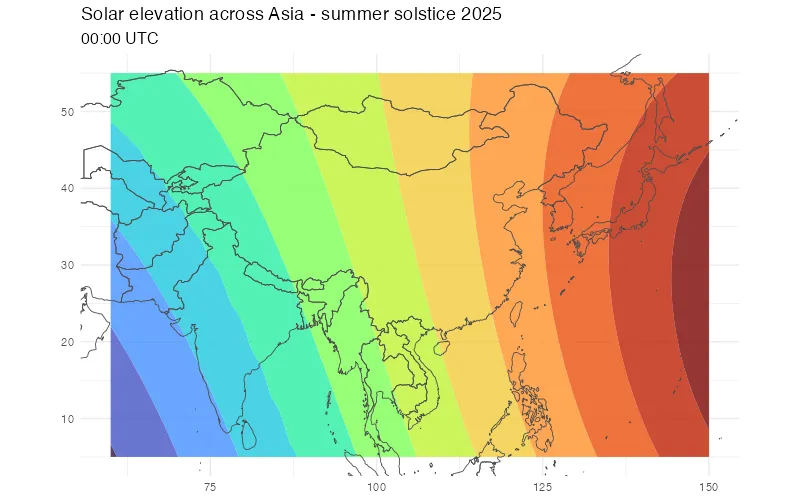

```{r setup, include=FALSE}
knitr::opts_chunk$set(echo = TRUE, warning = FALSE, message = FALSE)
```

Testing sunce's Parquet format support and ragg's WebP animation capabilities with solar elevation data across Asia.

## Data generation

First, let's generate solar elevation data for Asia. We'll use a time file combined with a coordinate sweep to get equinoxes and solstices in a single call and pipe it straight into read_csv.

```{r data-generation}
library(tidyverse)
library(arrow)
library(ragg)

# Generate seasonal data using streaming CSV approach
seasonal_dates <- c(
  "2025-03-20T06:00:00", "2025-06-21T06:00:00",
  "2025-09-23T06:00:00", "2025-12-21T06:00:00"
)
write_lines(seasonal_dates, "/tmp/seasonal_dates.txt")

# Stream sunce output directly into R using pipe (CSV format for streaming)
# Covering from Middle East to Japan, India to Siberia
solar_data <- read_csv(pipe(
  "sunce 5.0:55.0:1.0 60.0:150.0:1.5 @/tmp/seasonal_dates.txt --format=csv position --elevation-angle"
), show_col_types = FALSE) |>
  select(-elevation) |> # Drop elevation input column to avoid naming conflict
  rename(elevation = `elevation-angle`) |>
  mutate(
    season = case_when(
      as.Date(dateTime) == as.Date("2025-03-20") ~ "Spring Equinox",
      as.Date(dateTime) == as.Date("2025-06-21") ~ "Summer Solstice",
      as.Date(dateTime) == as.Date("2025-09-23") ~ "Autumn Equinox",
      as.Date(dateTime) == as.Date("2025-12-21") ~ "Winter Solstice"
    ),
    season = factor(season, levels = c(
      "Spring Equinox", "Summer Solstice",
      "Autumn Equinox", "Winter Solstice"
    ))
  )

cat("Total points:", nrow(solar_data), "\n")
cat("Points per frame:", nrow(solar_data) / 4, "\n")
```

## Static visualization

Create a static map showing all four seasons:

```{r static-map}
asia_map <- ggplot(solar_data, aes(x = longitude, y = latitude)) +
  geom_contour_filled(aes(z = elevation), bins = 15, alpha = 0.8) +
  borders("world", colour = "grey30", fill = NA, size = 0.3) +
  scale_fill_viridis_d(option = "turbo", name = "Elevation (°)") +
  coord_quickmap(xlim = c(60, 150), ylim = c(5, 55)) +
  facet_wrap(~season, nrow = 2) +
  labs(
    title = "Solar elevation across Asia",
    subtitle = "At 06:00 UTC",
    x = NULL, y = NULL
  ) +
  theme_minimal() +
  theme(
    legend.position = "right",
    plot.title = element_text(size = 14, face = "bold"),
    strip.text = element_text(size = 11, face = "bold")
  )

asia_map
```

## Animated version

Now let's create an animated WebP using ragg 1.5+'s animation support, showing hourly progression throughout a single day. Since this is a lot of data, use parquet data format. (This can't be streamed directly, as `read_parquet()` requires a random access file.)

```{r animation}
# Use Parquet format for the larger animation dataset (24 hours × many coordinates)
system(
  "sunce 5.0:55.0:2.0 60.0:150.0:3.0 2025-06-21 --timezone=UTC --format=parquet position --step=1h --elevation-angle > /tmp/asia_hourly.parquet"
)

# Read hourly data from Parquet file
hourly_data <- read_parquet("/tmp/asia_hourly.parquet") |>
  select(-elevation) |> # Drop elevation input column to avoid naming conflict
  rename(elevation = `elevation-angle`) |>
  mutate(
    dateTime = ymd_hms(dateTime), # Parse datetime string to POSIXct
    hour = hour(dateTime),
    time_label = sprintf("%02d:00 UTC", hour)
  )

# Create WebP animation using ragg's agg_webp_anim device
agg_webp_anim("figure/asia_solar.webp",
  width = 800, height = 500, units = "px", res = 96,
  delay = 500, loop = 10, lossy = TRUE
)

hourly_data |>
  group_by(hour) |>
  group_walk(~ {
    p <- ggplot(.x, aes(x = longitude, y = latitude)) +
      geom_contour_filled(aes(z = elevation), bins = 12, alpha = 0.8) +
      borders("world", colour = "grey30", fill = NA, size = 0.3) +
      scale_fill_viridis_d(option = "turbo", guide = "none") +
      coord_quickmap(xlim = c(60, 150), ylim = c(5, 55)) +
      labs(
        title = "Solar elevation across Asia - summer solstice 2025",
        subtitle = unique(.x$time_label),
        x = NULL, y = NULL
      ) +
      theme_minimal() +
      theme(
        plot.title = element_text(size = 14),
        plot.subtitle = element_text(size = 12)
      )

    print(p)
  })

dev.off()
```



