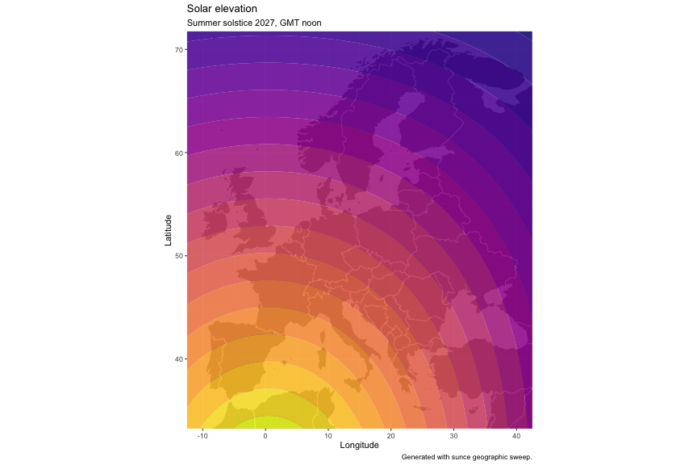
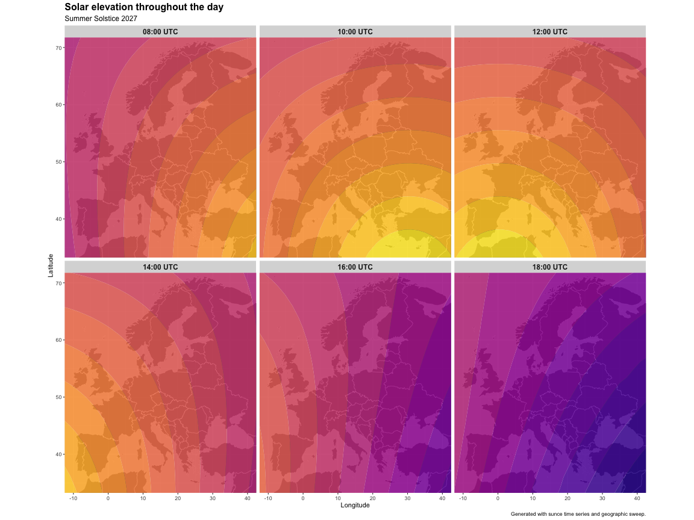

This demonstrates the `sunce` geographic sweep and time series features.

## Data generation

Generate solar elevation data across Europe using coordinate ranges:


``` r
library(tidyverse)
library(lubridate)

# Generate European solar elevation data using sunce geographic sweep
system(
  "sunce --format=csv 32.0:73.0:0.5 -13.0:43.0:0.5 2027-06-21T12:00:00Z position --elevation-angle > /tmp/europe_dense.csv"
)

solar_data <- read_csv("/tmp/europe_dense.csv", show_col_types = FALSE) |>
  select(-elevation) |> # Drop elevation input column to avoid naming conflict
  rename(elevation = `elevation-angle`)

cat("Dataset:", nrow(solar_data), "points\n")
```

```
## Dataset: 9379 points
```

``` r
cat("Elevation range:", round(min(solar_data$elevation), 1), "to", round(max(solar_data$elevation), 1), "degrees\n")
```

```
## Elevation range: 35.3 to 81.4 degrees
```

## Visualization

Create a filled contour map showing solar elevation gradients:


``` r
solar_map <- ggplot(solar_data, aes(x = longitude, y = latitude)) +
  borders(
    "world",
    colour = "white",
    fill = "grey20",
    size = 0.3,
    alpha = 0.8
  ) +
  geom_contour_filled(aes(z = elevation), alpha = 0.85, bins = 20) +
  scale_fill_viridis_d(option = "plasma") +
  guides(fill = "none") +
  coord_quickmap(xlim = c(-10, 40), ylim = c(35, 70)) +
  labs(
    title = "Solar elevation",
    subtitle = "Summer solstice 2027, GMT noon",
    x = "Longitude",
    y = "Latitude",
    caption = "Generated with sunce geographic sweep."
  )

solar_map
```



This shows how solar elevation varies across Europe at GMT/UTC noon on the summer solstice, with higher elevations (brighter colors) in southern regions and lower elevations (darker colors) in northern regions.

## Time series 

Now let's see how this solar elevation pattern changes throughout the day by asking `sunce` for a combined coordinate sweep and time series in one call. Use the Grena3 algorithm to potentially save a little time.


``` r
result <- system(
  "sunce --format=csv --headers 32.0:73.0:2.0 -13.0:43.0:2.0 2027-06-21 --timezone=UTC position --step=1h --algorithm=GRENA3 --elevation-angle > /tmp/europe_time_series.csv"
)

raw_data <- read_csv("/tmp/europe_time_series.csv", show_col_types = FALSE)
time_data <- raw_data |>
  select(-elevation) |> # Drop elevation input column to avoid naming conflict
  rename(elevation = `elevation-angle`) |>
  mutate(
    datetime_parsed = as.POSIXct(dateTime),
    hour = hour(datetime_parsed)
  )

cat("Unique hours in data:", sort(unique(time_data$hour)), "\n")
```

```
## Unique hours in data: 0 1 2 3 4 5 6 7 8 9 10 11 12 13 14 15 16 17 18 19 20 21 22 23
```

``` r
time_data <- time_data |>
  filter(hour >= 6, hour <= 18, !is.na(elevation)) %>%
  arrange(hour, latitude, longitude)

time_data
```

```
## # A tibble: 8,294 × 10
##    latitude longitude pressure temperature dateTime            deltaT azimuth
##       <dbl>     <dbl>    <dbl>       <dbl> <dttm>               <dbl>   <dbl>
##  1       32       -13     1013          15 2027-06-21 06:00:00      0    63.2
##  2       32       -11     1013          15 2027-06-21 06:00:00      0    64.3
##  3       32        -9     1013          15 2027-06-21 06:00:00      0    65.3
##  4       32        -7     1013          15 2027-06-21 06:00:00      0    66.3
##  5       32        -5     1013          15 2027-06-21 06:00:00      0    67.2
##  6       32        -3     1013          15 2027-06-21 06:00:00      0    68.2
##  7       32        -1     1013          15 2027-06-21 06:00:00      0    69.1
##  8       32         1     1013          15 2027-06-21 06:00:00      0    70.1
##  9       32         3     1013          15 2027-06-21 06:00:00      0    71.0
## 10       32         5     1013          15 2027-06-21 06:00:00      0    71.9
## # ℹ 8,284 more rows
## # ℹ 3 more variables: elevation <dbl>, datetime_parsed <dttm>, hour <int>
```


``` r
# Create faceted plot showing solar elevation throughout the day
selected_hours <- c(8, 10, 12, 14, 16, 18)
facet_data <- time_data |>
  filter(hour %in% selected_hours) |>
  mutate(hour_label = paste0(sprintf("%02d", hour), ":00 UTC"))

time_series_plot <- ggplot(facet_data, aes(x = longitude, y = latitude)) +
  borders(
    "world",
    colour = "white",
    fill = "grey20",
    size = 0.3,
    alpha = 0.8
  ) +
  geom_contour_filled(aes(z = elevation), alpha = 0.85, bins = 20) +
  scale_fill_viridis_d(option = "plasma") +
  guides(fill = "none") +
  coord_quickmap(xlim = c(-10, 40), ylim = c(35, 70)) +
  facet_wrap(~hour_label, ncol = 3) +
  labs(
    title = "Solar elevation throughout the day",
    subtitle = "Summer Solstice 2027",
    x = "Longitude",
    y = "Latitude",
    caption = "Generated with sunce time series and geographic sweep."
  ) +
  theme(
    strip.text = element_text(size = 12, face = "bold"),
    plot.title = element_text(size = 16, face = "bold"),
    plot.subtitle = element_text(size = 12)
  )

time_series_plot
```



These time series snapshots show the "solar elevation wave" moving across Europe throughout the day.
