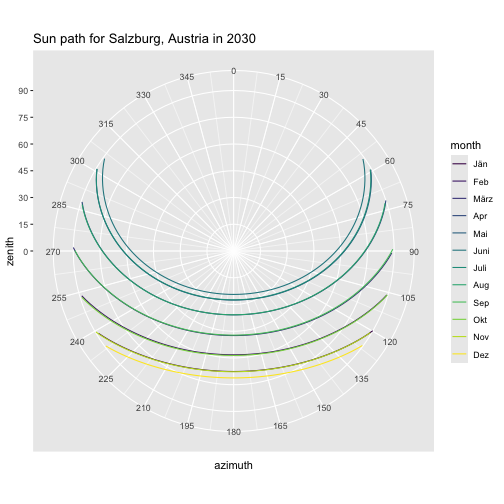
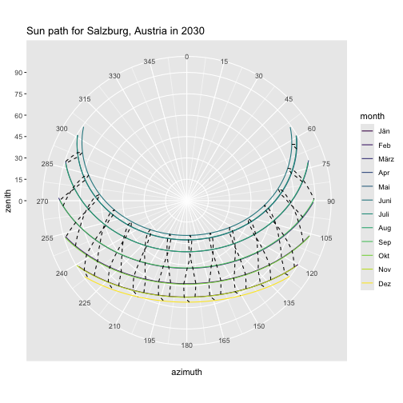

First, run [sunce](https://github.com/klausbrunner/sunce) and capture its output in a CSV file. We're getting position data for the entire year 2030 in Salzburg, Austria. 


``` zsh
sunce 47.795 13.047 2030 --timezone=UTC --deltat --format=csv --headers position --step=10m > /tmp/sunpositions.csv
```

Now read that CSV and pick data for one day of each month. While we're at it, remove all observations where the sun isn't visible anyway (i.e. zenith angle is greater than 90°) and add a convenient "month" column. This will come in handy for the diagram.


``` r
library(tidyverse)
library(lubridate, warn.conflicts = FALSE)

sunpath <- read_csv("/tmp/sunpositions.csv",
  show_col_types = FALSE
) |>
  filter(day(dateTime) == 21) |>
  filter(zenith <= 90.0) |>
  mutate(month = month(dateTime, label = TRUE))

sunpath
```

```
## # A tibble: 876 × 10
##    latitude longitude elevation pressure temperature dateTime            deltaT
##       <dbl>     <dbl>     <dbl>    <dbl>       <dbl> <dttm>               <dbl>
##  1     47.8      13.0         0     1013          15 2030-01-21 06:50:00   74.0
##  2     47.8      13.0         0     1013          15 2030-01-21 07:00:00   74.0
##  3     47.8      13.0         0     1013          15 2030-01-21 07:10:00   74.0
##  4     47.8      13.0         0     1013          15 2030-01-21 07:20:00   74.0
##  5     47.8      13.0         0     1013          15 2030-01-21 07:30:00   74.0
##  6     47.8      13.0         0     1013          15 2030-01-21 07:40:00   74.0
##  7     47.8      13.0         0     1013          15 2030-01-21 07:50:00   74.0
##  8     47.8      13.0         0     1013          15 2030-01-21 08:00:00   74.0
##  9     47.8      13.0         0     1013          15 2030-01-21 08:10:00   74.0
## 10     47.8      13.0         0     1013          15 2030-01-21 08:20:00   74.0
## # ℹ 866 more rows
## # ℹ 3 more variables: azimuth <dbl>, zenith <dbl>, month <ord>
```

Now plot a simple sun path diagram.


``` r
plot <- ggplot() +
  geom_line(data = sunpath, aes(x = azimuth, y = zenith, group = month, colour = month)) +
  scale_y_continuous(limits = c(0, 90), breaks = seq(0, 90, by = 15)) +
  scale_x_continuous(limits = c(0, 360), breaks = seq(0, 359, by = 15)) +
  labs(title = "Sun path for Salzburg, Austria in 2030") +
  coord_polar()

plot
```



Let's see if we can add the analemma lines for each hour as well.


``` r
hours <- sunpath |>
  filter(minute(dateTime) == 0, second(dateTime) == 0) |>
  mutate(hour = hour(dateTime))

plot <- plot +
  geom_path(data = hours, aes(x = azimuth, y = zenith, group = hour), linetype = "dashed")

plot
```



Let's see if we can add labels to those. This requires a bit of manual adjustment.


``` r
hour_ends <- hours |> filter(month == "Jun")

plot <- plot +
  geom_label(data = hour_ends, nudge_y = -6, label.padding = unit(0.1, "lines"), size = 2, aes(x = azimuth, y = zenith, label = hour))

plot
```


